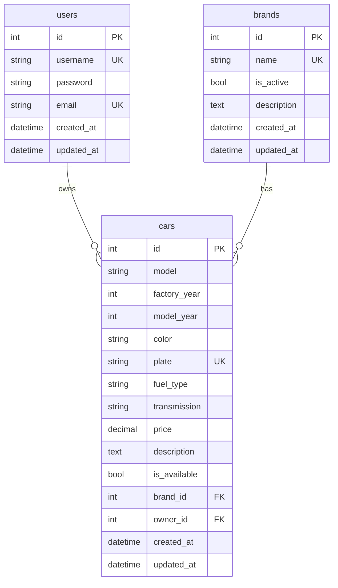
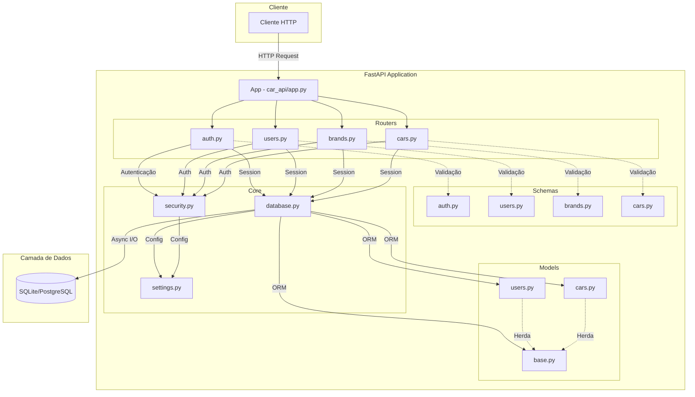
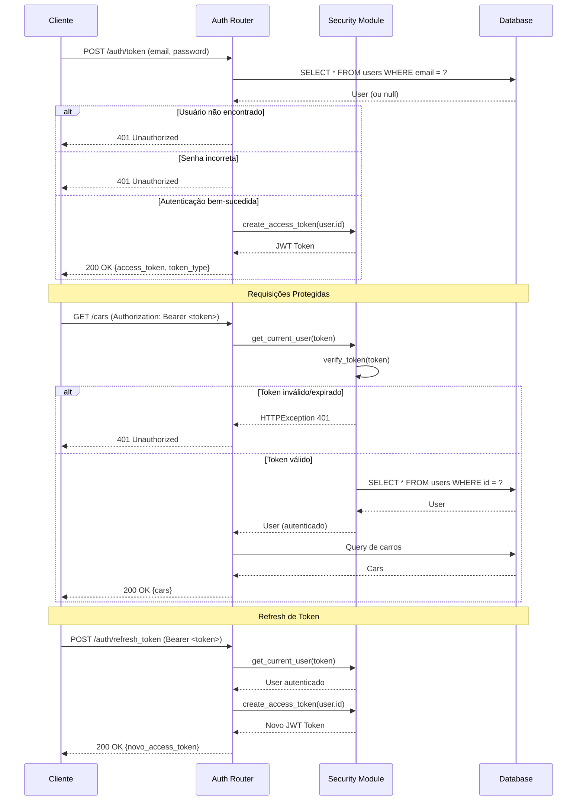
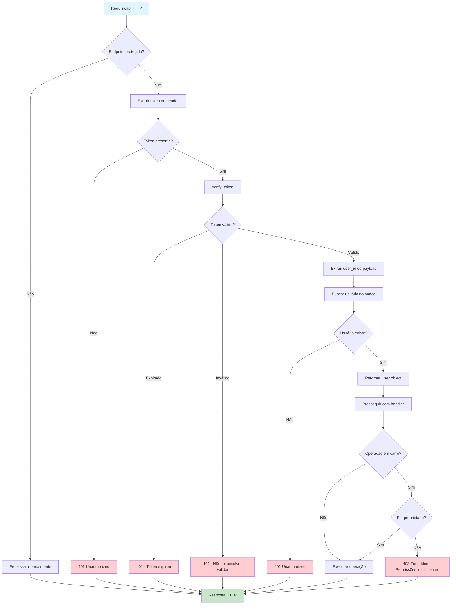

# Modelagem do Sistema

Esta seção apresenta os diagramas e modelos de dados do sistema utilizando Mermaid.

## Modelos de Dados (ERD)

O diagrama de entidade-relacionamento abaixo mostra os modelos do banco de dados e seus relacionamentos:

### Relacionamentos

| Relação | Tipo | Descrição |
|---------|------|-----------|
| `users` → `cars` | 1:N | Um usuário pode possuir vários carros |
| `brands` → `cars` | 1:N | Uma marca pode ter vários carros |
| `cars` → `users` | N:1 | Cada carro pertence a um único usuário |
| `cars` → `brands` | N:1 | Cada carro pertence a uma única marca |

### Enums

**FuelType (fuel_type):**
- `gasoline` - Gasolina
- `ethanol` - Etanol
- `flex` - Flex
- `diesel` - Diesel
- `electric` - Elétrico
- `hybrid` - Híbrido

**TransmissionType (transmission):**
- `manual` - Manual
- `automatic` - Automática
- `semi_automatic` - Semi-automática
- `cvt` - CVT

---

## Arquitetura do Sistema

A arquitetura do sistema segue o padrão REST com camadas bem definidas:

### Fluxo de Requisição

1. **Cliente** envia requisição HTTP
2. **App** roteia para o **Router** correspondente
3. **Router** valida dados de entrada com **Schemas** (Pydantic)
4. **Router** verifica autenticação via **Security**
5. **Router** obtém sessão do banco via **Database**
6. **Database** executa operações com **Models** (SQLAlchemy ORM)
7. **Router** retorna resposta serializada via **Schemas**

---

## Fluxo de Autenticação

O fluxo de autenticação utiliza tokens JWT (JSON Web Tokens):

### Características do Token

- **Algoritmo**: HS256 (HMAC-SHA256)
- **Payload**: `{sub: user_id, exp: expiration_time}`
- **Expiração padrão**: 30 minutos
- **Transporte**: Header `Authorization: Bearer <token>`

---

## Fluxo CRUD de Carros

O ciclo de vida completo de operações com carros:

```mermaid
sequenceDiagram
    participant Client as Cliente (Autenticado)
    participant Router as Cars Router
    participant Security as Security Module
    participant DB as Database

    Note over Client,DB: CREATE - Criar Carro
    
    Client->>Router: POST /cars {car_data}
    Router->>Security: get_current_user(token)
    Security-->>Router: User autenticado
    
    Router->>DB: Verificar plate existente
    alt Placa já existe
        DB-->>Router: True
        Router-->>Client: 400 Bad Request
    else Placa disponível
        DB-->>Router: False
        Router->>DB: Verificar brand_id existe
        alt Marca não existe
            DB-->>Router: False
            Router-->>Client: 400 Bad Request
        else Marca existe
            DB-->>Router: True
            Router->>DB: INSERT INTO cars (owner_id = user.id)
            DB-->>Router: Car criado
            Router-->>Client: 201 Created {car}
        end
    end

    Note over Client,DB: READ - Listar/Buscar Carros
    
    Client->>Router: GET /cars?search=corolla&brand_id=1
    Router->>Security: get_current_user(token)
    Security-->>Router: User autenticado
    Router->>DB: SELECT cars WHERE filters
    DB-->>Router: Lista de carros
    Router-->>Client: 200 OK {cars, offset, limit}

    Note over Client,DB: UPDATE - Atualizar Carro
    
    Client->>Router: PUT /cars/{id} {update_data}
    Router->>Security: get_current_user(token)
    Security-->>Router: User autenticado
    Router->>DB: SELECT car WHERE id = ?
    
    alt Carro não existe
        DB-->>Router: Null
        Router-->>Client: 404 Not Found
    else Carro existe
        DB-->>Router: Car
        Router->>Router: verify_car_ownership(user, car.owner_id)
        
        alt Não é proprietário
            Router-->>Client: 403 Forbidden
        else É proprietário
            Router->>DB: UPDATE cars SET ...
            DB-->>Router: Car atualizado
            Router-->>Client: 200 OK {car}
        end
    end

    Note over Client,DB: DELETE - Deletar Carro
    
    Client->>Router: DELETE /cars/{id}
    Router->>Security: get_current_user(token)
    Security-->>Router: User autenticado
    Router->>DB: SELECT car WHERE id = ?
    Router->>Router: verify_car_ownership(user, car.owner_id)
    
    alt Não é proprietário
        Router-->>Client: 403 Forbidden
    else É proprietário
        Router->>DB: DELETE FROM cars WHERE id = ?
        DB-->>Router: Sucesso
        Router-->>Client: 204 No Content
    end

    Note over Client,DB: TRANSFER - Transferir Carro
    
    Client->>Router: POST /cars/{id}/transfer {new_owner_id}
    Router->>Security: get_current_user(token)
    Security-->>Router: User autenticado (atual)
    Router->>DB: SELECT car WHERE id = ?
    Router->>Router: verify_car_ownership(user, car.owner_id)
    
    alt Não é proprietário
        Router-->>Client: 403 Forbidden
    else É proprietário
        Router->>DB: SELECT user WHERE id = new_owner_id
        
        alt Novo proprietário não existe
            DB-->>Router: Null
            Router-->>Client: 404 Not Found
        else Novo proprietário existe
            DB-->>Router: New Owner
            Router->>DB: UPDATE cars SET owner_id = new_owner_id
            DB-->>Router: Sucesso
            Router-->>Client: 200 OK {car com novo owner}
        end
    end
```

---

## Fluxo de Segurança

O sistema de segurança abrange autenticação, autorização e validação de propriedade:

### Camadas de Segurança

| Camada | Mecanismo | Descrição |
|--------|-----------|-----------|
| **Autenticação** | JWT Bearer Token | Verifica identidade do usuário |
| **Validação de Token** | PyJWT + HS256 | Garante integridade e expiração |
| **Autorização** | `get_current_user` | Verifica existência do usuário |
| **Propriedade** | `verify_car_ownership` | Garante acesso apenas a recursos próprios |
| **Validação de Input** | Pydantic Schemas | Previne dados malformados |
| **Hash de Senha** | Argon2 (via pwdlib) | Armazenamento seguro de senhas |
| **Unicidade** | DB Constraints | Prev duplicatas de username, email, placa |
